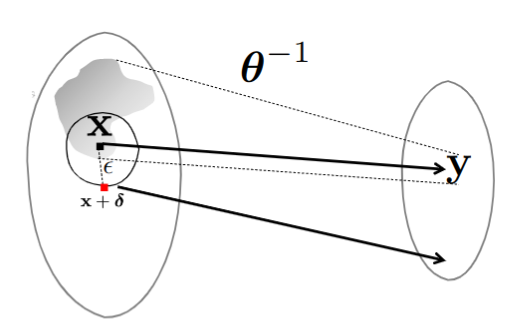
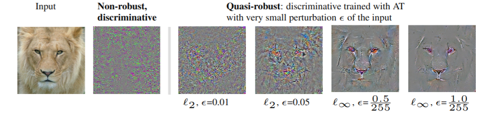

<br/>
<p align="center">
  <a href="https://github.com//Robust-Generative">
    
  </a>

  <h3 align="center">Robust-Generative</h3>

  <p align="center">
    Repository of the paper ["Exploring the Connection between Robust and Generative Models"](https://arxiv.org/abs/2304.04033)
    <br/>
    <br/>
  </p>
</p>


## About The Project



We offer a study that connects robust discriminative classifiers trained with adversarial training (AT) with generative modeling in the form of Energy-based Models (EBM). We do so by decomposing the loss of a discriminative classifier and showing that the discriminative model is also aware of the input data density. Though a common assumption is that adversarial points leave the manifold of the input data, our study finds out that, surprisingly, untargeted adversarial points in the input space are very likely under the generative model hidden inside the discriminative classifier---have low energy in the EBM. We present two evidence: untargeted attacks are even more likely than the natural data and their likelihood increases as the attack strength increases. This allows us to easily detect them and craft a novel attack called High-Energy PGD that fools the classifier yet has energy similar to the data set.

## Getting Started

You can replicate the results on the notebooks jupyter.

### Prerequisites

Requirements are described in the requirements file.

### Usage

The detector and the HE-PGD algorithm can be used to defend and attack neural networks.
_For more details, please refer to the [paper](https://arxiv.org/abs/2304.04033)_


### BibTeX Citation

If you find the paper interesting and you'll use in your research, we appreciate if you cite the paper :)

```
@article{beadini2023exploring,
  title={Exploring the Connection between Robust and Generative Models},
  author={Beadini, Senad and Masi, Iacopo},
  journal={arXiv preprint arXiv:2304.04033},
  year={2023}
}
```
### License

Distributed under the MIT License. See [LICENSE](https://github.com//Robust-Generative/blob/main/LICENSE.md) for more information.